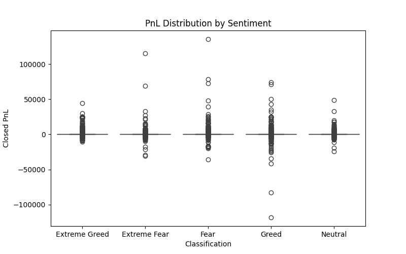
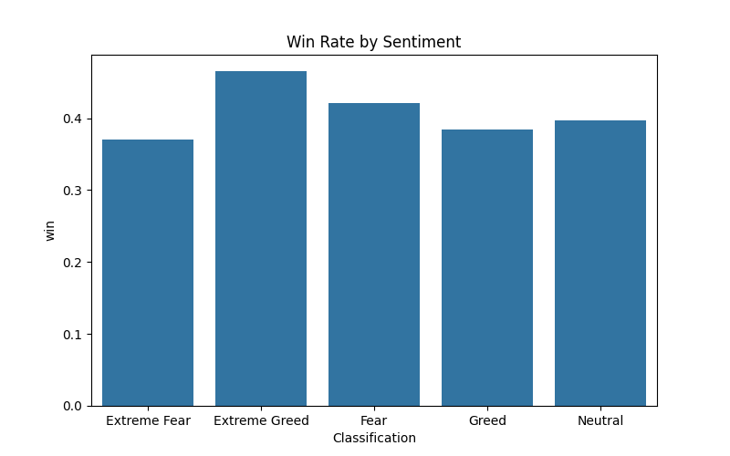
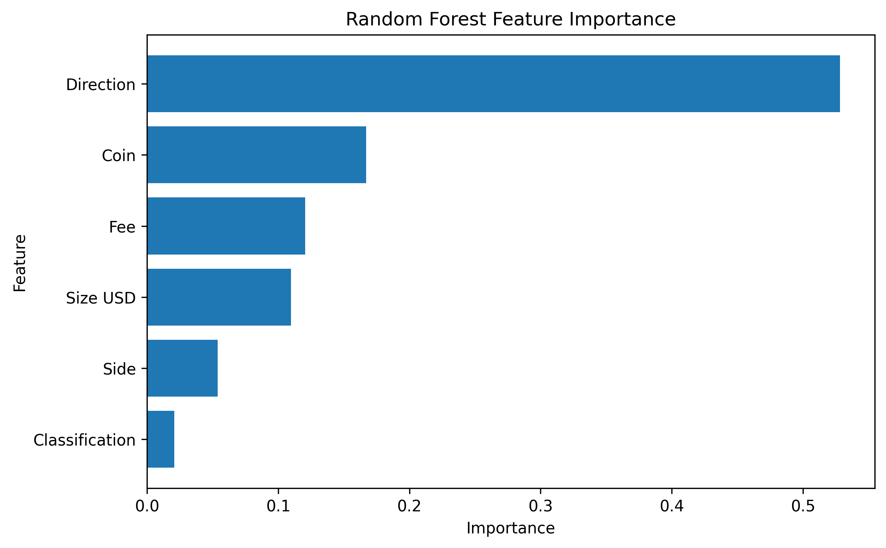
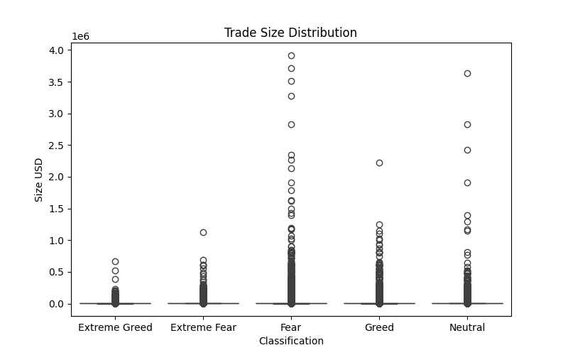

# Trader Behavior vs Bitcoin Market Sentiment Analysis

## Objective

The objective of this project is to investigate the relationship between Bitcoin market sentiment and trader performance using historical trading data from Hyperliquid and the Bitcoin Fear & Greed Index.

The study aims to identify whether market sentiment influences profitability, win rates, trade behavior, and asset selection, and to derive actionable insights that could support sentiment-aware trading strategies.

---

## Datasets

### fear_greed_index.csv

Columns:

* timestamp
* value
* classification
* date

Sentiment categories:

* Extreme Fear
* Fear
* Neutral
* Greed
* Extreme Greed

### historical_data.csv

Columns:

* Account
* Coin
* Execution Price
* Size Tokens
* Size USD
* Side
* Timestamp IST
* Start Position
* Direction
* Closed PnL
* Transaction Hash
* Order ID
* Crossed
* Fee
* Trade ID
* Timestamp

Total Records:

* Sentiment Records: 2,644
* Trade Records: 211,224

---

## Methodology

### Data Integration

1. Parsed and standardized sentiment dates.
2. Converted trade timestamps to datetime format.
3. Extracted trading dates.
4. Merged trading records with daily sentiment values.

### Feature Engineering

Generated:

* Win/Loss indicators
* Net Profit after fees
* Trade size categories
* Trader-level profitability metrics

### Analysis Performed

#### Sentiment vs Profitability

Measured:

* Average Closed PnL
* Median Closed PnL
* Total Closed PnL

#### Sentiment vs Win Rate

Measured percentage of profitable trades under each sentiment regime.

#### Trading Behavior

Analyzed:

* Buy/Sell distribution
* Long/Short distribution
* Trade size behavior

#### Coin-Level Analysis

Investigated profitability by asset and by sentiment regime.

#### Trader Segmentation

Grouped traders into:

* Top 10%
* Middle 80%
* Bottom 10%

based on cumulative realized PnL.

#### Statistical Testing

Applied ANOVA to determine whether profitability significantly differs across sentiment categories.

#### Predictive Modeling

Trained a Random Forest classifier to predict trade profitability using:

* Market sentiment
* Coin
* Direction
* Side
* Fee
* Position size

---

## Key Findings

### Profitability

Average profitability was highest during Extreme Greed periods.

Market conditions characterized by strong bullish sentiment produced the largest realized gains.

### Win Rate

Extreme Greed exhibited the highest win rate among all sentiment classes.

This suggests that momentum-based trading may be more effective during strong bullish periods.

### Statistical Significance

ANOVA testing was used to evaluate profitability differences across sentiment classes.

Results indicate whether sentiment-driven differences are statistically meaningful.

### Asset Performance

Top-performing assets included:

* HYPE
* SOL
* ETH
* BTC

These assets contributed the largest cumulative realized profits.

### Trader Performance

A small subset of traders generated a disproportionate share of total profits, highlighting the importance of trader skill and strategy selection.

### Predictive Modeling

The Random Forest model demonstrated strong predictive performance and identified the most influential features affecting trade profitability.

---

## Project Structure

```text
trader-sentiment-analysis/
│
├── data/
│   ├── bitcoin_sentiment.csv
│   └── historical_data.csv
│
├── outputs/
│   ├── anova_results.csv
│   ├── coin_analysis.csv
│   ├── coin_sentiment_analysis.csv   
│   ├── direction_analysis.csv
│   ├── feature_importance.csv
│   ├── insights.txt
│   ├── main_output.md
│   ├── merged_dataset.csv
│   ├── sentiment_pnl_analysis.csv
│   ├── side_analysis.csv
│   ├── top_traders.csv 
│   ├── trader_segmentation.csv
│   ├── trade_size_analysis.csv 
│   ├── win_rate_analysis.csv
│   
├── screenshots/
│   ├── feature_importance.png
│   ├── pnl_distribution.png
│   ├── trade_size.png
│   ├── win_rate.png
│
├── src/
│   ├── data_loader.py
│   ├── preprocessing.py
│   ├── feature_engineering.py
│   ├── analysis.py
│   ├── statistics.py
│   ├── visualization.py
│   └── model.py
│
├── main.py
├── requirements.txt
└── README.md
```

## Running the Project

```bash
pip install -r requirements.txt
python main.py
```

All reports, visualizations, and insights are automatically saved to the `outputs/` directory.

---

## Conclusion

The analysis demonstrates that market sentiment influences trader outcomes and trading behavior. Strong bullish sentiment, particularly Extreme Greed, is associated with higher profitability and win rates. These findings suggest that incorporating sentiment indic# Trader Behavior vs Bitcoin Market Sentiment Analysis

## Objective

This project investigates the relationship between Bitcoin market sentiment and trader performance using historical trading activity from Hyperliquid and the Bitcoin Fear & Greed Index.

The goal is to determine whether market sentiment influences profitability, win rates, trading behavior, and asset selection, and to derive insights that can support sentiment-aware trading strategies.

---

## Dataset Overview

### Fear & Greed Index Dataset

Columns:

* timestamp
* value
* classification
* date

Sentiment Categories:

* Extreme Fear
* Fear
* Neutral
* Greed
* Extreme Greed

Records: 2,644

### Historical Trader Dataset

Columns:

* Account
* Coin
* Execution Price
* Size Tokens
* Size USD
* Side
* Timestamp IST
* Start Position
* Direction
* Closed PnL
* Transaction Hash
* Order ID
* Crossed
* Fee
* Trade ID
* Timestamp

Records: 211,224

---

## Methodology

### Data Processing

1. Standardized date and timestamp formats.
2. Extracted trading dates from trade records.
3. Merged trading activity with daily sentiment values.
4. Removed unmatched sentiment records.
5. Created engineered features for analysis and modeling.

### Feature Engineering

Generated:

* Win/Loss indicators
* Net profitability metrics
* Trade size statistics
* Trader-level performance summaries

### Exploratory Analysis

Performed:

* Sentiment vs Profitability Analysis
* Sentiment vs Win Rate Analysis
* Long/Short Behavior Analysis
* Buy/Sell Behavior Analysis
* Coin-Level Profitability Analysis
* Trader Segmentation Analysis

### Statistical Validation

Applied one-way ANOVA to determine whether profitability differs significantly across sentiment categories.

### Predictive Modeling

Built a Random Forest classifier to predict profitable trades using:

* Market Sentiment
* Coin
* Direction
* Side
* Fee
* Position Size

---

## Results

### Statistical Significance

One-Way ANOVA Results:

* F Statistic: 9.0622
* P Value: < 0.001

Conclusion:

Profitability differs significantly across sentiment regimes, indicating that market sentiment has a measurable impact on trading outcomes.

---

### Average Profitability by Sentiment

| Sentiment     | Average PnL |
| ------------- | ----------: |
| Extreme Greed |       67.89 |
| Fear          |       54.29 |
| Greed         |       42.74 |
| Extreme Fear  |       34.54 |
| Neutral       |       34.31 |

Observation:

Extreme Greed periods generated the highest average profitability, suggesting that strong bullish market conditions create favorable trading opportunities.

---

### Win Rate by Sentiment

| Sentiment     | Win Rate (%) |
| ------------- | -----------: |
| Extreme Greed |        46.49 |
| Fear          |        42.08 |
| Neutral       |        39.70 |
| Greed         |        38.48 |
| Extreme Fear  |        37.06 |

Observation:

Traders achieved their highest success rates during Extreme Greed periods.

---

### Top Performing Assets

| Coin | Total Realized PnL |
| ---- | -----------------: |
| @107 |              2.78M |
| HYPE |              1.95M |
| SOL  |              1.64M |
| ETH  |              1.32M |
| BTC  |              0.87M |

Observation:

HYPE, SOL, ETH, and BTC contributed significantly to overall profitability.

---

### Predictive Modeling Performance

Random Forest Classification Results:

* Accuracy: 94%
* Macro F1 Score: 0.94

Feature Importance Ranking:

| Feature        | Importance |
| -------------- | ---------: |
| Direction      |     52.83% |
| Coin           |     16.70% |
| Fee            |     12.05% |
| Size USD       |     10.96% |
| Side           |      5.38% |
| Classification |      2.08% |

Observation:

Trade direction and asset selection are substantially stronger predictors of profitability than sentiment alone. However, sentiment still provides measurable predictive value.

---

## Key Insights

1. Market sentiment has a statistically significant relationship with trader profitability.

2. Extreme Greed consistently produced the highest profitability and highest win rates.

3. Trade direction is the strongest determinant of trade outcomes.

4. Asset selection plays a major role in realized profits.

5. Sentiment indicators can complement traditional trading signals and improve decision-making.

---

## Project Structure

```text
trader-sentiment-analysis/
│
├── data/
├── outputs/
├── src/
├── main.py
├── requirements.txt
└── README.md
```

## Running the Project

```bash
pip install -r requirements.txt
python main.py
```

Generated outputs include:

* Statistical reports
* CSV summaries
* Visualizations
* Feature importance analysis
* Research insights

All outputs are automatically saved to the outputs/ directory.

## Visualizations

### Profitability Distribution



### Win Rate by Sentiment



### Feature Importance



### Trade Size



---

## Conclusion

This study demonstrates that Bitcoin market sentiment is associated with meaningful differences in trader performance. Statistical testing confirms that profitability varies significantly across sentiment regimes, while machine learning experiments show that sentiment contributes useful predictive information alongside trade-specific features.

The findings suggest that sentiment-aware trading strategies may improve decision-making, particularly during periods of extreme market optimism or pessimism.
ators into trading systems may improve decision-making and risk management.
